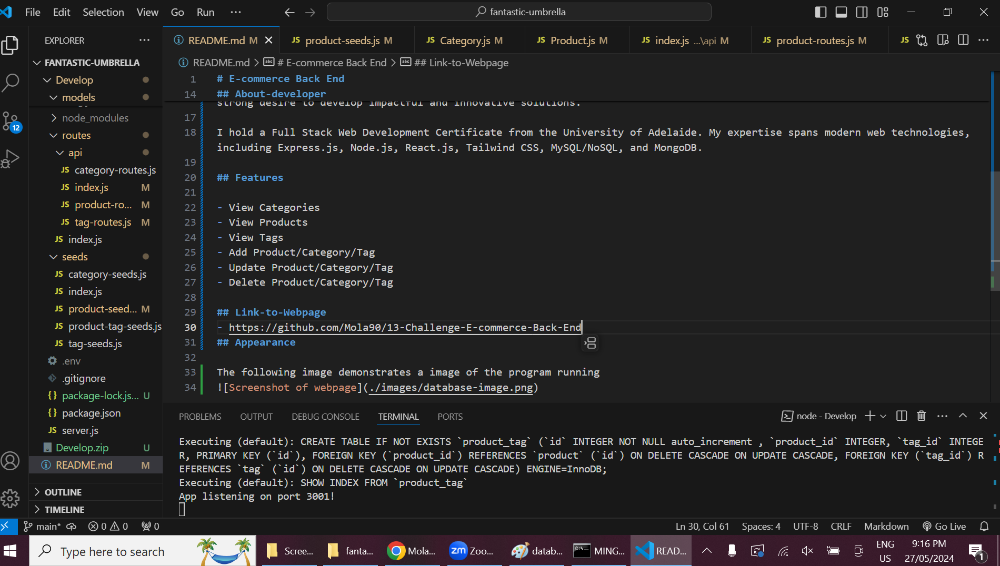

# E-commerce Back End 

This application demonstrates an E-commerce Back End, designed to manage an online retail database. Using Express.js, Sequelize, and MySQL, this app enables internet retail companies to efficiently handle their product categories, inventory, and tags. This back-end solution ensures that businesses can effectively compete in the e-commerce market by leveraging the latest technologies.

## Table of Contents

- [Features](#features)
- [Link-to-Webpage](#Link-to-Webpage)
- [Appearance](#Appearance)
- [About-Developer](#About-developer)
- 

## About-developer

Hello! I'm Molaligne (Mola) Dafa, a dedicated web developer with a passion for reading, understanding how things work, and creating solutions that make the world a better place. My journey into web development stems from a deep curiosity and a strong desire to develop impactful and innovative solutions.

I hold a Full Stack Web Development Certificate from the University of Adelaide. My expertise spans modern web technologies, including Express.js, Node.js, React.js, Tailwind CSS, MySQL/NoSQL, and MongoDB.

## Features

- View Categories
- View Products
- View Tags
- Add Product/Category/Tag
- Update Product/Category/Tag
- Delete Product/Category/Tag 
  
## Link-to-Webpage
- https://github.com/Mola90/13-Challenge-E-commerce-Back-End
## Appearance

The following image demonstrates a image of the program running

Link to vide: https://drive.google.com/file/d/171xKpZfiMD8MMjwbTl2xBz16Nv79rXO0/view